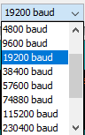

  Thanks for choosing IntruderBeware! The first thing you'll need to do is download this repository. Download the zip of it, and then unzip it.  
  Now, get a ESP32 Feather. You can get one here: https://adafru.it/3405  
  Find the folder called "code". Open it, and find the folder called "setupwizard". Open it, too.  
  Now, make sure you have the Arduino IDE installed. If not, download it here: https://www.arduino.cc/en/Main/Software  
If you need to, restart your computer.  
  When you're back in /code/setupwizard, open the file called setupwizard.ino (or on Windows it might be called just setupwizard). The Arduino IDE should open.  
  Take your ESP32 Feather, and find a matching USB cable. If you've already plugged it in, unplug it.  
  Before we get started, we need to test your ESP32. In the Arduino IDE, click on File > Examples > 01.Basics > Blink.  
Now, click on Tools > Port. Write down all of the numbers and letters. Click away from Tools > Port now.  
Next, plug in your ESP32 Feather. Click on Tools > Port again. Find the combination of numbers and letters that isn't on the list, and click on it.  
  After that, click on File > Preferences. Find the place where it says "Additional Boards Manager URLs:". Click on the icon that looks like this:   
If you already have added an additional board manager URL, press enter. Now type "https://dl.espressif.com/dl/package_esp32_index.json" into the window. Press OK, and then click OK again.  
  Now, press Tools > Board > Boards Manager... and type ESP32 into the search bar. Then, click the button that says "Install".  
It'll take a while to install. When it's done, close the window. Now you can finally test your ESP32 Feather!  
  Click on Tools > Board. Scroll down, and under ESP32 Arduino, you should find "Adafruit ESP32 Feather". Click on it! You're so close!  
  Now, press the upload button. It looks like this:   
  In a little, your ESP32 Feather should start blinking!  
  Now, you need to get your PCB. OSHPark makes great PCBs. It's okay that you get 3, because you'll want multiple IntruderBewares to protect your house. You can find pictures of the PCB, the Gerber files, and the .fzz files in the /PCB Files/ directory.
  Time to go shopping! Here's a list:
+ MicroSD breakout (https://adafru.it/254)
+ NeoPixel strip (https://adafru.it/3636 (cut to size needed, and can use other neopixels))
+ PIR motion sensor (https://adafru.it/189)
+ 3 IR LEDs (https://adafru.it/388)
+ Piezo buzzer (https://adafru.it/160)
+ Speakers with 3-pin (ground, left channel, right channel)
+ 3-pin audio jack (https://adafru.it/2791)
+ Arducam 5MP module (https://bit.ly/2PjWdNe)

  Are you done? Great! Let's start soldering! You'll need to solder at least 62 points.
1. First, let's solder up the MicroSD breakout. You might want to put it on 1 in. wires. You're already more than 1/10 done!
2. Second, solder the piezo buzzer. 1/8 of the way there!
3. Third, let's add the speaker. There's only 3 wires to solder to the plug, but it's a very important part!
4. Fourth, solder up the ESP32 Feather! Don't worry if it takes a while. You're already 1/2 of the way there!
5. Fifth, solder a very important part: the camera! You're 3/4 of the way done already!
6. Sixth, let's solder up the PIR. You may want to use female headers, so you can plug and unplug it.
7. Seventh, add your NeoPixels to the mix. Remember, a lot adds up!
8. For the last step I can help you with, add the IR LEDs. Remember to add resistors!  
DO NOT solder the jumper.  
  We can finally test everything! Plug in the ESP32 Feather to your computer. Do you immediately see the "CHG" LED rapidly blinking and that your computer detects the ESP32 Feather? If not, immediately YANK the cord out, and make an issue on GitHub. If it does, great! Go on to the next step.  
  Now, find the window in the Arduino IDE titled "setupwizard.ino". Press the upload button. If you need a refresher, it looks like this:   
  Now, open the Serial Monitor. It has a button that looks like this:   
  Make sure your baud rate is set to 9600 baud. There's a dropdown menu that looks like this:  
    
  Next, you can reset the ESP32 Feather! I'll guide you through what it should say.  
1. Welcome to the IntruderBeware setup wizard! Wait a moment as I setup the inputs, outputs, and EEPROM...  
Hopefully it doesn't say this: Failed to initialise EEPROM!  
2. Done! First, let's setup your PIR. Go behind your PIR, so it can't see you. In five seconds, I'll take 10 snapshots of the PIR pin.  
3. Taking shapshots...  
4. Okay, now let's have you make a whole bunch of motion. Again, in 5 seconds, I'll take 10 snapshots.  
5. Taking shapshots...  
6. Hmm... let me figure out if your PIR is reverse...  
Hopefully, it says this: It's reverse! Give me a second to save that...  
Or this: It's not reverse! Give me a second to save that...  
But not this: Hmm... I'm having trouble. Try again by resetting this, and put up a issue on GitHub.  
7. Now, let's test the buzzer. In 5 seconds, I'll play a low tone, a medium tone, and then a high tone.  
8. Did you hear the tones? y/n  
Hopefully it says this: Great!  
But not this: Hmm... try making a issue on GitHub.  
Or not this: Please type y or n.  
9. Cover your ears! In 5 seconds, I'll test the siren.  
10. Did you hear the tone? y/n  
